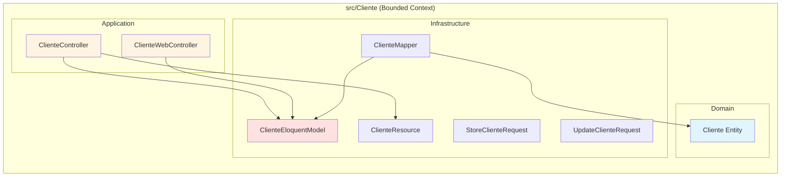
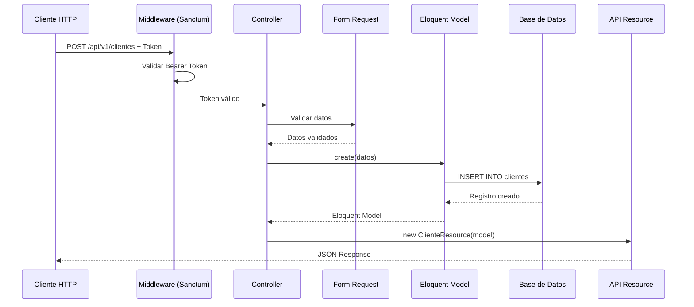
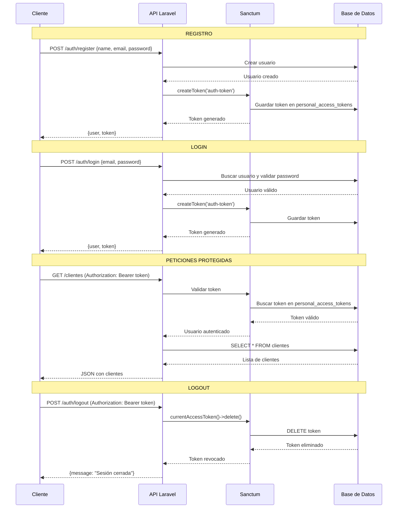
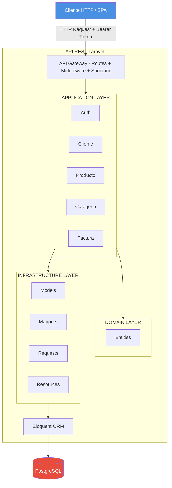
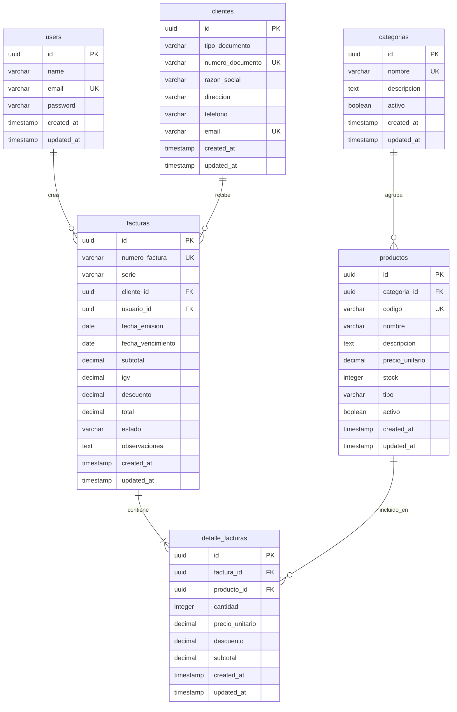

# Documentación API REST - Laravel

## Tabla de Contenidos
1. [Arquitectura](#arquitectura)
2. [Autenticación con Sanctum](#autenticación-con-sanctum)
3. [Estructura de Módulos](#estructura-de-módulos)
4. [Modelos y Base de Datos](#modelos-y-base-de-datos)
5. [API Endpoints](#api-endpoints)
6. [Ejemplos de cURL](#ejemplos-de-curl)

---

## Arquitectura

Este proyecto implementa una arquitectura **modular por Bounded Contexts** con una estructura simplificada:

### Estructura de Capas

```
src/
├── Auth/                         # Bounded Context con DDD completo
│   ├── Domain/
│   │   ├── Entities/            # Entidades del dominio
│   │   └── Contracts/           # Interfaces de repositorios
│   ├── Application/
│   │   ├── Actions/             # Casos de uso
│   │   └── Controllers/         # Controladores HTTP
│   └── Infrastructure/
│       ├── Models/              # Modelos Eloquent
│       ├── Repositories/        # Implementación de repositorios
│       ├── Requests/            # Form Requests
│       ├── Resources/           # API Resources
│       └── Migrations/          # Migraciones
│
├── {OtrosBoundedContexts}/       # Estructura simplificada (sin DDD)
│   ├── Domain/
│   │   └── Entities/            # Entidades del dominio
│   ├── Application/
│   │   └── Controllers/         # Controladores HTTP (Eloquent directo)
│   └── Infrastructure/
│       ├── Models/              # Modelos Eloquent
│       ├── Mappers/             # Conversión Entity ↔ Eloquent
│       ├── Requests/            # Form Requests
│       ├── Resources/           # API Resources
│       └── Migrations/          # Migraciones
```

### Bounded Contexts

| Módulo | Arquitectura | Descripción |
|--------|--------------|-------------|
| Auth | DDD completo | Autenticación con Actions, Contracts, Repositories |
| Categoria | Simplificada | CRUD directo con Eloquent |
| Cliente | Simplificada | CRUD directo con Eloquent |
| Producto | Simplificada | CRUD directo con Eloquent |
| Factura | Simplificada | CRUD directo con Eloquent |
| DetalleFactura | Simplificada | CRUD directo con Eloquent |

### Diagramas de Arquitectura

#### 1. Estructura de un Bounded Context Simplificado



#### 2. Flujo de una Petición HTTP (Simplificado)



#### 3. Flujo de Autenticación con Sanctum



#### 4. Arquitectura Completa de la Aplicación



---

## Autenticación con Sanctum

### ¿Qué es Laravel Sanctum?

Laravel Sanctum proporciona un sistema de autenticación ligero para SPAs y APIs simples mediante tokens.

### Características

- **Token API**: Genera tokens de acceso para autenticación
- **Bearer Authentication**: Los tokens se envían en el header `Authorization: Bearer {token}`
- **Revocación de tokens**: Permite eliminar tokens (logout)

### Flujo de Autenticación

1. **Registro/Login** → Genera token con `createToken()`
2. **Cliente guarda token** en localStorage/sessionStorage
3. **Peticiones protegidas** → Envía header `Authorization: Bearer {token}`
4. **Middleware** `auth:sanctum` valida el token
5. **Logout** → Elimina el token actual con `currentAccessToken()->delete()`

### Middleware de Protección

```php
Route::middleware('auth:sanctum')->group(function () {
    Route::apiResource('clientes', ClienteController::class);
    Route::apiResource('facturas', FacturaController::class);
});
```

---

## Estructura de Módulos

### Módulo de Autenticación (Auth) - DDD Completo

**Ubicación:** `src/Auth/`

Este es el único módulo que mantiene la arquitectura DDD completa con Actions, Contracts y Repositories.

#### Estructura
```
src/Auth/
├── Domain/
│   ├── Entities/User.php
│   └── Contracts/UserRepositoryInterface.php
├── Application/
│   ├── Actions/
│   │   ├── LoginAction.php
│   │   ├── RegisterAction.php
│   │   ├── LogoutAction.php
│   │   └── GetMeAction.php
│   └── Controllers/
│       ├── AuthController.php
│       └── WebAuthController.php
└── Infrastructure/
    ├── Models/UserEloquentModel.php
    ├── Repositories/EloquentUserRepository.php
    ├── Requests/
    │   ├── LoginRequest.php
    │   └── RegisterRequest.php
    └── Resources/UserResource.php
```

---

### Módulos Simplificados (Categoria, Cliente, Producto, Factura, DetalleFactura)

Estos módulos usan Eloquent directamente sin la capa de Actions, Contracts ni Repositories.

#### Estructura de Cliente (ejemplo)
```
src/Cliente/
├── Domain/
│   └── Entities/Cliente.php
├── Application/
│   └── Controllers/
│       ├── ClienteController.php      # API REST
│       └── ClienteWebController.php   # Web (Inertia)
└── Infrastructure/
    ├── Models/ClienteEloquentModel.php
    ├── Mappers/ClienteMapper.php
    ├── Requests/
    │   ├── StoreClienteRequest.php
    │   └── UpdateClienteRequest.php
    └── Resources/ClienteResource.php
```

#### Controlador API (Ejemplo: ClienteController)
```php
class ClienteController extends Controller
{
    public function index()
    {
        $clientes = ClienteEloquentModel::all();
        return ClienteResource::collection($clientes);
    }

    public function store(StoreClienteRequest $request)
    {
        $cliente = ClienteEloquentModel::create($request->validated());
        return new ClienteResource($cliente);
    }

    public function show(string $id)
    {
        $cliente = ClienteEloquentModel::find($id);
        if (!$cliente) {
            return response()->json(['success' => false, 'message' => 'Cliente no encontrado'], 404);
        }
        return new ClienteResource($cliente);
    }

    public function update(UpdateClienteRequest $request, string $id)
    {
        $cliente = ClienteEloquentModel::find($id);
        if (!$cliente) {
            return response()->json(['success' => false, 'message' => 'Cliente no encontrado'], 404);
        }
        $cliente->update($request->validated());
        return new ClienteResource($cliente);
    }

    public function destroy(string $id)
    {
        $cliente = ClienteEloquentModel::find($id);
        if (!$cliente) {
            return response()->json(['success' => false, 'message' => 'Cliente no encontrado'], 404);
        }
        if ($cliente->facturas()->exists()) {
            return response()->json(['success' => false, 'message' => 'No se puede eliminar este cliente porque tiene facturas asociadas'], 400);
        }
        $cliente->delete();
        return response()->json(['success' => true, 'message' => 'Cliente eliminado exitosamente'], 200);
    }
}
```

---

## Modelos y Base de Datos

### Diagrama ER de Base de Datos



### Relaciones entre Modelos

```
User (1) ----< (N) Factura
Cliente (1) ----< (N) Factura
Factura (1) ----< (N) DetalleFactura
Producto (1) ----< (N) DetalleFactura
Categoria (1) ----< (N) Producto
```

---

## API Endpoints

### Base URL
```
http://localhost:8000/api/v1
```

### Autenticación

| Método | Endpoint | Middleware | Descripción |
|--------|----------|-----------|-------------|
| POST | `/auth/register` | - | Registrar nuevo usuario |
| POST | `/auth/login` | - | Iniciar sesión |
| POST | `/auth/logout` | auth:sanctum | Cerrar sesión |
| GET | `/auth/me` | auth:sanctum | Obtener usuario autenticado |

### Categorías

| Método | Endpoint | Middleware | Descripción |
|--------|----------|-----------|-------------|
| GET | `/categorias` | auth:sanctum | Listar todas las categorías |
| POST | `/categorias` | auth:sanctum | Crear categoría |
| GET | `/categorias/{id}` | auth:sanctum | Obtener categoría por ID |
| PUT | `/categorias/{id}` | auth:sanctum | Actualizar categoría |
| DELETE | `/categorias/{id}` | auth:sanctum | Eliminar categoría |

### Clientes

| Método | Endpoint | Middleware | Descripción |
|--------|----------|-----------|-------------|
| GET | `/clientes` | auth:sanctum | Listar todos los clientes |
| POST | `/clientes` | auth:sanctum | Crear cliente |
| GET | `/clientes/{id}` | auth:sanctum | Obtener cliente por ID |
| PUT | `/clientes/{id}` | auth:sanctum | Actualizar cliente |
| DELETE | `/clientes/{id}` | auth:sanctum | Eliminar cliente |

### Productos

| Método | Endpoint | Middleware | Descripción |
|--------|----------|-----------|-------------|
| GET | `/productos` | auth:sanctum | Listar todos los productos |
| POST | `/productos` | auth:sanctum | Crear producto |
| GET | `/productos/{id}` | auth:sanctum | Obtener producto por ID |
| PUT | `/productos/{id}` | auth:sanctum | Actualizar producto |
| DELETE | `/productos/{id}` | auth:sanctum | Eliminar producto |

### Facturas

| Método | Endpoint | Middleware | Descripción |
|--------|----------|-----------|-------------|
| GET | `/facturas` | auth:sanctum | Listar todas las facturas |
| POST | `/facturas` | auth:sanctum | Crear factura con detalles |
| GET | `/facturas/{id}` | auth:sanctum | Obtener factura por ID |
| PUT | `/facturas/{id}` | auth:sanctum | Actualizar factura |
| DELETE | `/facturas/{id}` | auth:sanctum | Eliminar factura |

### Detalles de Factura

| Método | Endpoint | Middleware | Descripción |
|--------|----------|-----------|-------------|
| GET | `/detalle-facturas` | auth:sanctum | Listar todos los detalles |
| POST | `/detalle-facturas` | auth:sanctum | Crear detalle |
| GET | `/detalle-facturas/{id}` | auth:sanctum | Obtener detalle por ID |
| PUT | `/detalle-facturas/{id}` | auth:sanctum | Actualizar detalle |
| DELETE | `/detalle-facturas/{id}` | auth:sanctum | Eliminar detalle |

---

## Ejemplos de cURL

### Variables de entorno
```bash
# Configurar estas variables antes de ejecutar los comandos
BASE_URL="http://localhost:8000/api/v1"
TOKEN=""  # Se obtiene después del login
```

---

### 1. Registro de Usuario

```bash
curl -X POST "$BASE_URL/auth/register" \
  -H "Content-Type: application/json" \
  -H "Accept: application/json" \
  -d '{
    "name": "Juan Pérez",
    "email": "juan.perez@example.com",
    "password": "password123",
    "password_confirmation": "password123"
  }'
```

**Respuesta:**
```json
{
  "success": true,
  "message": "Usuario registrado exitosamente",
  "data": {
    "user": {
      "id": "9d3e4b5a-6c7d-8e9f-0a1b-2c3d4e5f6a7b",
      "name": "Juan Pérez",
      "email": "juan.perez@example.com",
      "createdAt": "2026-01-18 10:30:00",
      "updatedAt": "2026-01-18 10:30:00"
    },
    "access_token": "1|abcdefghijklmnopqrstuvwxyz123456789",
    "token_type": "Bearer"
  }
}
```

---

### 2. Login

```bash
curl -X POST "$BASE_URL/auth/login" \
  -H "Content-Type: application/json" \
  -H "Accept: application/json" \
  -d '{
    "email": "juan.perez@example.com",
    "password": "password123"
  }'
```

**Respuesta:**
```json
{
  "success": true,
  "message": "Inicio de sesión exitoso",
  "data": {
    "user": {
      "id": "9d3e4b5a-6c7d-8e9f-0a1b-2c3d4e5f6a7b",
      "name": "Juan Pérez",
      "email": "juan.perez@example.com",
      "createdAt": "2026-01-18 10:30:00",
      "updatedAt": "2026-01-18 10:30:00"
    },
    "access_token": "2|zyxwvutsrqponmlkjihgfedcba987654321",
    "token_type": "Bearer"
  }
}
```

```bash
# Guardar el token para las siguientes peticiones
TOKEN="2|zyxwvutsrqponmlkjihgfedcba987654321"
```

---

### 3. Obtener Usuario Autenticado

```bash
curl -X GET "$BASE_URL/auth/me" \
  -H "Accept: application/json" \
  -H "Authorization: Bearer $TOKEN"
```

**Respuesta:**
```json
{
  "success": true,
  "data": {
    "id": "9d3e4b5a-6c7d-8e9f-0a1b-2c3d4e5f6a7b",
    "name": "Juan Pérez",
    "email": "juan.perez@example.com",
    "createdAt": "2026-01-18 10:30:00",
    "updatedAt": "2026-01-18 10:30:00"
  }
}
```

---

### 4. Crear Categoría

```bash
curl -X POST "$BASE_URL/categorias" \
  -H "Content-Type: application/json" \
  -H "Accept: application/json" \
  -H "Authorization: Bearer $TOKEN" \
  -d '{
    "nombre": "Electrónica",
    "descripcion": "Productos electrónicos y tecnología",
    "activo": true
  }'
```

**Respuesta:**
```json
{
  "data": {
    "id": "7b1c2d3e-4f5a-6b7c-8d9e-0f1a2b3c4d5e",
    "nombre": "Electrónica",
    "descripcion": "Productos electrónicos y tecnología",
    "activo": true,
    "createdAt": "2026-01-18 11:00:00",
    "updatedAt": "2026-01-18 11:00:00"
  }
}
```

---

### 5. Listar Categorías

```bash
curl -X GET "$BASE_URL/categorias" \
  -H "Accept: application/json" \
  -H "Authorization: Bearer $TOKEN"
```

**Respuesta:**
```json
{
  "data": [
    {
      "id": "7b1c2d3e-4f5a-6b7c-8d9e-0f1a2b3c4d5e",
      "nombre": "Electrónica",
      "descripcion": "Productos electrónicos y tecnología",
      "activo": true,
      "createdAt": "2026-01-18 11:00:00",
      "updatedAt": "2026-01-18 11:00:00"
    }
  ]
}
```

---

### 6. Crear Cliente

```bash
curl -X POST "$BASE_URL/clientes" \
  -H "Content-Type: application/json" \
  -H "Accept: application/json" \
  -H "Authorization: Bearer $TOKEN" \
  -d '{
    "tipo_documento": "RUC",
    "numero_documento": "20123456789",
    "razon_social": "Empresa ABC SAC",
    "direccion": "Av. Principal 123, Lima",
    "telefono": "987654321",
    "email": "contacto@empresaabc.com"
  }'
```

**Respuesta:**
```json
{
  "data": {
    "id": "8c2d3b4a-5c6d-7e8f-9a0b-1c2d3e4f5a6b",
    "tipoDocumento": "RUC",
    "numeroDocumento": "20123456789",
    "razonSocial": "Empresa ABC SAC",
    "direccion": "Av. Principal 123, Lima",
    "telefono": "987654321",
    "email": "contacto@empresaabc.com",
    "createdAt": "2026-01-18 11:30:00",
    "updatedAt": "2026-01-18 11:30:00"
  }
}
```

---

### 7. Listar Clientes

```bash
curl -X GET "$BASE_URL/clientes" \
  -H "Accept: application/json" \
  -H "Authorization: Bearer $TOKEN"
```

---

### 8. Obtener Cliente por ID

```bash
CLIENTE_ID="8c2d3b4a-5c6d-7e8f-9a0b-1c2d3e4f5a6b"

curl -X GET "$BASE_URL/clientes/$CLIENTE_ID" \
  -H "Accept: application/json" \
  -H "Authorization: Bearer $TOKEN"
```

---

### 9. Actualizar Cliente

```bash
CLIENTE_ID="8c2d3b4a-5c6d-7e8f-9a0b-1c2d3e4f5a6b"

curl -X PUT "$BASE_URL/clientes/$CLIENTE_ID" \
  -H "Content-Type: application/json" \
  -H "Accept: application/json" \
  -H "Authorization: Bearer $TOKEN" \
  -d '{
    "telefono": "998877665",
    "direccion": "Av. Los Olivos 456, Lima"
  }'
```

---

### 10. Eliminar Cliente

```bash
CLIENTE_ID="8c2d3b4a-5c6d-7e8f-9a0b-1c2d3e4f5a6b"

curl -X DELETE "$BASE_URL/clientes/$CLIENTE_ID" \
  -H "Accept: application/json" \
  -H "Authorization: Bearer $TOKEN"
```

**Respuesta (Éxito):**
```json
{
  "success": true,
  "message": "Cliente eliminado exitosamente"
}
```

**Respuesta (Error - Cliente con facturas):**
```json
{
  "success": false,
  "message": "No se puede eliminar este cliente porque tiene facturas asociadas"
}
```

---

### 11. Crear Producto

```bash
CATEGORIA_ID="7b1c2d3e-4f5a-6b7c-8d9e-0f1a2b3c4d5e"

curl -X POST "$BASE_URL/productos" \
  -H "Content-Type: application/json" \
  -H "Accept: application/json" \
  -H "Authorization: Bearer $TOKEN" \
  -d '{
    "categoria_id": "'$CATEGORIA_ID'",
    "codigo": "LAPTOP-001",
    "nombre": "Laptop HP Pavilion 15",
    "descripcion": "Laptop HP Pavilion 15 pulgadas, Intel Core i5, 8GB RAM",
    "precio_unitario": 2500.00,
    "stock": 10,
    "tipo": "bien",
    "activo": true
  }'
```

**Respuesta:**
```json
{
  "data": {
    "id": "6a0b1c2d-3e4f-5a6b-7c8d-9e0f1a2b3c4d",
    "categoriaId": "7b1c2d3e-4f5a-6b7c-8d9e-0f1a2b3c4d5e",
    "codigo": "LAPTOP-001",
    "nombre": "Laptop HP Pavilion 15",
    "descripcion": "Laptop HP Pavilion 15 pulgadas, Intel Core i5, 8GB RAM",
    "precioUnitario": "2500.00",
    "stock": 10,
    "tipo": "bien",
    "activo": true,
    "createdAt": "2026-01-18 12:00:00",
    "updatedAt": "2026-01-18 12:00:00"
  }
}
```

---

### 12. Listar Productos

```bash
curl -X GET "$BASE_URL/productos" \
  -H "Accept: application/json" \
  -H "Authorization: Bearer $TOKEN"
```

---

### 13. Crear Factura con Detalles

```bash
CLIENTE_ID="8c2d3b4a-5c6d-7e8f-9a0b-1c2d3e4f5a6b"
PRODUCTO_ID="6a0b1c2d-3e4f-5a6b-7c8d-9e0f1a2b3c4d"

curl -X POST "$BASE_URL/facturas" \
  -H "Content-Type: application/json" \
  -H "Accept: application/json" \
  -H "Authorization: Bearer $TOKEN" \
  -d '{
    "numero_factura": "F001-00001",
    "serie": "F001",
    "cliente_id": "'$CLIENTE_ID'",
    "fecha_emision": "2026-01-18",
    "fecha_vencimiento": "2026-02-18",
    "subtotal": 2500.00,
    "igv": 450.00,
    "descuento": 0.00,
    "total": 2950.00,
    "estado": "emitida",
    "observaciones": "Primera factura",
    "detalles": [
      {
        "producto_id": "'$PRODUCTO_ID'",
        "cantidad": 1,
        "precio_unitario": 2500.00,
        "descuento": 0.00,
        "subtotal": 2500.00
      }
    ]
  }'
```

**Respuesta:**
```json
{
  "data": {
    "id": "5a9b0c1d-2e3f-4a5b-6c7d-8e9f0a1b2c3d",
    "numeroFactura": "F001-00001",
    "serie": "F001",
    "clienteId": "8c2d3b4a-5c6d-7e8f-9a0b-1c2d3e4f5a6b",
    "usuarioId": "9d3e4b5a-6c7d-8e9f-0a1b-2c3d4e5f6a7b",
    "fechaEmision": "2026-01-18",
    "fechaVencimiento": "2026-02-18",
    "subtotal": "2500.00",
    "igv": "450.00",
    "descuento": "0.00",
    "total": "2950.00",
    "estado": "emitida",
    "observaciones": "Primera factura",
    "cliente": {
      "id": "8c2d3b4a-5c6d-7e8f-9a0b-1c2d3e4f5a6b",
      "razonSocial": "Empresa ABC SAC"
    },
    "detalles": [
      {
        "id": "4a8b9c0d-1e2f-3a4b-5c6d-7e8f9a0b1c2d",
        "productoId": "6a0b1c2d-3e4f-5a6b-7c8d-9e0f1a2b3c4d",
        "cantidad": 1,
        "precioUnitario": "2500.00",
        "descuento": "0.00",
        "subtotal": "2500.00"
      }
    ],
    "createdAt": "2026-01-18 13:00:00",
    "updatedAt": "2026-01-18 13:00:00"
  }
}
```

---

### 14. Listar Facturas

```bash
curl -X GET "$BASE_URL/facturas" \
  -H "Accept: application/json" \
  -H "Authorization: Bearer $TOKEN"
```

---

### 15. Obtener Factura por ID

```bash
FACTURA_ID="5a9b0c1d-2e3f-4a5b-6c7d-8e9f0a1b2c3d"

curl -X GET "$BASE_URL/facturas/$FACTURA_ID" \
  -H "Accept: application/json" \
  -H "Authorization: Bearer $TOKEN"
```

---

### 16. Actualizar Estado de Factura

```bash
FACTURA_ID="5a9b0c1d-2e3f-4a5b-6c7d-8e9f0a1b2c3d"

curl -X PUT "$BASE_URL/facturas/$FACTURA_ID" \
  -H "Content-Type: application/json" \
  -H "Accept: application/json" \
  -H "Authorization: Bearer $TOKEN" \
  -d '{
    "estado": "pagada"
  }'
```

---

### 17. Eliminar Factura

```bash
FACTURA_ID="5a9b0c1d-2e3f-4a5b-6c7d-8e9f0a1b2c3d"

curl -X DELETE "$BASE_URL/facturas/$FACTURA_ID" \
  -H "Accept: application/json" \
  -H "Authorization: Bearer $TOKEN"
```

**Respuesta:**
```json
{
  "success": true,
  "message": "Factura eliminada exitosamente"
}
```

---

### 18. Logout

```bash
curl -X POST "$BASE_URL/auth/logout" \
  -H "Accept: application/json" \
  -H "Authorization: Bearer $TOKEN"
```

**Respuesta:**
```json
{
  "success": true,
  "message": "Sesión cerrada exitosamente"
}
```

---

## Códigos de Respuesta HTTP

| Código | Significado | Descripción |
|--------|-------------|-------------|
| 200 | OK | Petición exitosa |
| 201 | Created | Recurso creado exitosamente |
| 400 | Bad Request | Error de validación o regla de negocio |
| 401 | Unauthorized | Token inválido o no proporcionado |
| 404 | Not Found | Recurso no encontrado |
| 422 | Unprocessable Entity | Errores de validación |
| 500 | Internal Server Error | Error del servidor |

---

## Troubleshooting

### Error: "Unauthenticated"
- Verifica que el token sea válido
- Verifica que el header sea: `Authorization: Bearer {token}`
- Verifica que el token no haya sido revocado

### Error: "The given data was invalid"
- Revisa los campos requeridos
- Verifica que los campos sean del tipo correcto
- Revisa los nombres de los campos (snake_case para la API)

### Error: "No se puede eliminar este cliente porque tiene facturas asociadas"
- El cliente tiene facturas relacionadas
- Primero elimina las facturas asociadas

---

## Conclusión

Esta API REST implementa una arquitectura modular con:
- **Autenticación segura** mediante Laravel Sanctum
- **Módulo Auth con DDD completo** (Actions, Contracts, Repositories)
- **Módulos simplificados** usando Eloquent directamente
- **Validación** en Form Requests
- **Transformación** con API Resources
- **Reglas de negocio** en controladores (ej: no eliminar cliente con facturas)
